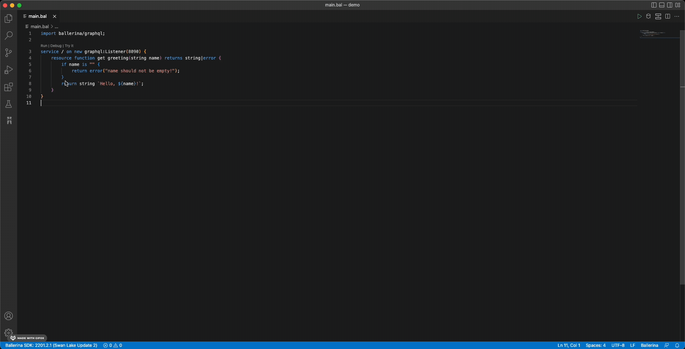

# Try GraphQL services with Ballerina
GraphQL is an open-source data query and manipulation language for APIs. While you develop an HTTP service, you need to try it and debug it to check how it works. The Ballerina VS Code plugin provides the GraphQL Try it view, which gives the ability to try GraphQL services within VS Code instead of using any third-party software.

## Set up the prerequisites
1. Install the latest versions of [Ballerina](https://ballerina.io/downloads/) and [Ballerina Visual Studio Code plugin](https://marketplace.visualstudio.com/items?itemName=wso2.ballerina).

2. Execute the command below to create a package (if you are not already working on one).

    ```bash
    bal new graphql
    ```
3. Open the created package in VS Code.

## Write the GraphQL service
Add the code below to the `main.bal` file.
```ballerina
import ballerina/graphql;

# A service representing a network-accessible GraphQL API.
service / on new graphql:Listener(8090) {

    # A resource for generating greetings.
    # + name - the input string name
    # + return - string name with greeting message or error
    resource function get greeting(string name) returns string|error {
        // Send a response back to the caller.
        if name is "" {
            return error("name should not be empty!");
        }
        return "Hello, " + name;
    }
}
    
```

## Try the GraphQL service
Once you add the above function, the VS Code plugin will display a code lens called **Try it** on top of the function.

1. Click the **Run** code lens to run the program. 
    
    This opens the terminal and start running the service.
2. Click the **Try it** code lens to open the GraphQL Try it view.
   >**Info:** The service must be in the running state to use GraphQL Try it view.
3. Once the GraphQL view is opened, click the **Explorer** button to open the **Explorer** view.
   >**Tip:** You can find available APIs from the opened side menu.
4. Select the APIs from the **Explorer** menu to try. This will automatically generate the payload in the editor.
   >**Info:** You can edit the payload and add the required parameters (e.g., type your name under the name parameter). The **Prettify** button will format the code for you.
5. Click the **Run** button to send the request.

    The response gets displayed in the right-side window.

  
